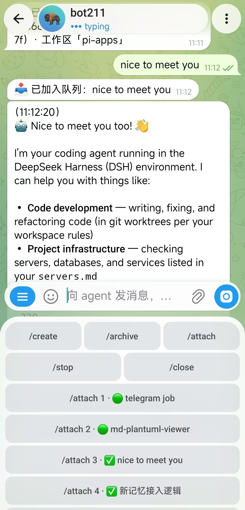

# 🤖 dsh-telegram

**DeepSeek Harness 的 Telegram 遥控台——把你的 Agent 装进口袋。**

在 Telegram 里遥控你的 dsh 会话：列会话、绑定、发消息、看实时流式回复、
一键作答 Agent 提问、停止或切换会话——走的是与 Web UI 完全同一条通道，
任何白名单内的聊天都能用。

[](#许可证)

[](README.md)

---

## ✨ 特性

- **完整会话遥控台**——`/attach` 绑定会话、`/status` 查看详情、普通文字直接当 prompt 发出，直播式回复在同一条消息上原地更新。
- **实时流式回复**——助手输出流式写入单条消息并随回合原地编辑（每步附带 `💭 Think` / `🔧 工具` 动作行），完成后渲染为 Telegram HTML 并以 token 用量脚注收尾。
- **提问变成按钮**——Agent 调用 `ask_user_question` 时弹出可作答的内联键盘：点一下就作答或取消；与 Web UI 按先到先得竞争，不冲突。
- **一键键盘操作**——回复键盘承载 `/create` `/archive` `/attach` 与 `/stop` `/close` 动作行；会话列表、工作区选择器都是内联按钮。几乎全是点按，敲字也全兼容。
- **安全默认**——只有 `allowChatIds` 里的聊天能使用；其他人一律回 `⛔ 无权访问。` 且拿不到任何会话信息。插件**不监听任何端口**：全部流量是出站的 Telegram 长轮询（可选经 CONNECT 代理）。
- **密钥零落地**——`botToken` 以 `!!js process.env.TELEGRAM_BOT_TOKEN` 引用，token 只存在于环境变量（或 `$DSH_HOME/.env`，0600）。
- **冷会话恢复**——绑定与发消息都走宿主 `apiProxy`，即 Web UI 同款通道，含冷会话恢复与排队语义。

## 📸 效果展示

<!--
  演示素材：把下面三个占位替换成你的真实录制（本节由仓库维护者补全）。

  建议录制（每条 10–20 秒，导出 GIF/WebM）：
  1. /attach → 发一条 prompt → 实时流式回复原地编辑 → 最终 HTML 回复
     <docs/demo/attach-stream.gif>
  2. 用回复键盘一路点按：/create → /new → 派个任务 → /stop 取消
     <docs/demo/keyboards.gif>
  3. Agent 提问 → 点内联答案按钮 → Agent 继续干活
     <docs/demo/ask-question.gif>

  录制工具：macOS QuickTime / OBS；GIF 用 ffmpeg 或 gifski 导出。
  单文件控制在 2 MB 内，放在 docs/demo/ 目录。
-->

> Telegram 里的实机使用效果：



| 绑定 + 流式回复 | 一键键盘 | 点按回答提问 |
| --- | --- | --- |
|  |  |  |

## 🚀 快速开始

### 前提

- 一份 **dsh 源码检出**（插件会装进它）——或已经跑起来的 dsh 部署（走[方式二](#方式二已有-dsh-部署)）。
- Node.js ≥ 22.19、pnpm、git。
- [@BotFather](https://t.me/BotFather) 创建的 bot token，且能出网访问 `api.telegram.org`（或可配 CONNECT 代理）。

### 方式一（推荐）：装进你的 dsh 源码

```bash
git clone https://github.com/Kevin66Z0/dsh-telegram.git dsh-telegram
cd dsh-host-telegram
./install.sh /path/to/deepseek-harness     # 你已有的 dsh 检出
```

`install.sh` 把插件同步到 `src/packages/host/telegram`、注册进 workspace，并在设置了
`DSH_HOME` 时把挂载行写进 `$DSH_HOME/profiles/web/cordis.patch.yml`。脚本幂等——以后
`git pull` 更新后重跑即可。

然后只需三步（一次）：

```bash
# 1) 注入 token（明文不落任何文件）
echo 'TELEGRAM_BOT_TOKEN=<@BotFather 的 token>' >> "$DSH_HOME/.env"; chmod 600 "$DSH_HOME/.env"

# 2) 白名单你的聊天（热加载，按字段覆盖插件行）— 写在 $DSH_HOME/settings.yaml：
#    telegram:
#      allowChatIds: [123456789]            # 你的 chat id（查法见下）
#      # proxy: 'http://127.0.0.1:7890'     # 仅当 api.telegram.org 被墙时才需要

# 3) 重启 dsh 服务（用你惯用的启动/部署命令）
```

**怎么查我的 chat id：**白名单留空时首次运行会在日志里打印所有被拒的 chat id——抄进
`allowChatIds` 即刻生效，无需重启。

**验证：**日志出现 `telegram: bot @<用户名> listening`；给 bot 发 `/start` 有响应。

### 方式二：已有 dsh 部署

不从源码运行的用户可直接把插件包装进 profile：

```bash
dsh plugin --profile web add git+https://github.com/Kevin66Z0/dsh-telegram.git
```

之后同样走上面的 token / 白名单 / 重启三步。此方式把插件装成独立包（所有
`@deepseek-ai/*` 依赖由运行中的 dsh 宿主解析）。两种方式不要混用：每个部署只保留一条
`id: telegram` 插件行。

### 更新 / 卸载

```bash
cd dsh-host-telegram && git pull && ./install.sh /path/to/deepseek-harness   # 更新
# 或包方式：  dsh plugin --profile web update/remove @deepseek-ai/dsh-host-telegram
```

## ⚙️ 配置

| 字段 | 类型 | 默认值 | 含义 |
| --- | --- | --- | --- |
| `botToken` | `string` | 必填 | bot token；以 `!!js process.env.TELEGRAM_BOT_TOKEN` 引用，经环境变量或 `$DSH_HOME/.env` 注入 |
| `allowChatIds` | `number[]` | 必填 | 允许使用该控制台的聊天；留空全部拒绝（首跑日志会打印被拒 id） |
| `proxy` | `string` | `ALL_PROXY`，随后 `HTTPS_PROXY` | Telegram API 流量的 HTTP CONNECT 代理 |

插件注册 `telegram` settings 命名空间：`$DSH_HOME/settings.yaml`（或 Web 设置页「插件 →
Telegram」卡片）里的字段按字段覆盖插件行，保存即热加载重建 bot 会话，无需重启。

## 🕹️ 命令速查

| 命令 | 作用 |
| --- | --- |
| `/attach [范围\|序号\|id\|none\|arc]` | 把本聊天绑定到会话（范围选择器 → 内联按钮会话列表），展示最近对话与回合中的动作；之后纯文本即发给该会话 |
| `/create` | 创建子菜单：`/new`（新会话）或 `/fork`（分叉绑定会话） |
| `/operate` | 操作子菜单：`/archive`、`/stop`、`/curTasks` |
| `/new [路径\|序号\|none]` | 创建会话（工作区选择器；`none` = 未分类） |
| `/fork [序号\|id]` | 从某会话最后一个已完成回合分叉出新会话并立即绑定 |
| `/archive [序号\|id]` | 归档会话（二次确认；取消分组并解绑） |
| `/delete [序号\|id]` | 从选择器归档 |
| `/stop` | 取消绑定会话进行中的回合（未绑定时以内联列表选择） |
| `/keyboard` | `/close` 或选择器覆盖后，一键唤回复键盘区 |
| `/status [序号\|id]` | 会话详情：最近助手输出、状态、用量脚注 |
| `/model [模型名]` | 设置全局默认模型（点模型列表或敲名字） |
| `/rename [标题]` | 重命名绑定会话（无参数时交互输入） |
| `/curTasks` | 打印绑定会话的任务清单（与 Web 侧栏同源） |
| `/preset [模式名\|序号]` | 选择会话模式（PTC / 标准 / 极简…） |
| `/start` | 完整帮助；`/close` 收起键盘 |

## 🔐 安全与隐私

- **白名单门禁**：`allowChatIds` 之外的聊天收到固定拒答，且了解不到任何会话信息。
- **零入站监听**：插件只做出站 Telegram 长轮询——不用开端口、不需要公网 IP，NAT 后也能用。
- **密钥不进配置**：token 是环境变量引用，文档与模板只含占位符。
- **轮换成本极低**：token 真泄露了去 @BotFather `/revoke` 重签——真正的访问控制是白名单，不是 token。

## 🧠 工作原理

```
  Telegram 应用            dsh 进程（同一个 node 进程）
 ┌───────────┐   HTTPS   ┌──────────────────────────────────────────┐
 │ 你的手机   │ ◄───────► │ grammY Bot（长轮询，本插件）              │
 └───────────┘  出站     │      │ apiProxy（Web UI 同款通道）         │
                         │      ▼                                    │
                         │  会话 / agent loop / LLM / 工具           │
                         └──────────────────────────────────────────┘
```

插件是一个 Cordis 函数插件（`name: telegram`，`inject: [apiProxy]`）——与 dsh 每个组件
相同的插件架构，可组合进任何叠了 `dsh-web-app` 的 profile（纯 headless 主机没有
`apiProxy`，无法挂载）。插件不拥有持久化事件流：它像 Web UI 一样读会话/提问事件源。

## ❓ 常见问题

**为什么必须用 web profile？** 插件经 `apiProxy` 驱动会话——那是 Web UI 的 RPC 通道；
纯 headless 的 dsh 没有 `apiProxy`。

**怎么找我的 chat id？** 白名单留空，给 bot 发一条消息，日志里"被拒聊天"那行就是。

**api.telegram.org 被墙怎么办？** 在 `telegram:` settings 段配 `proxy`
（默认回退 `ALL_PROXY`/`HTTPS_PROXY`）。

**我的 dsh 上游已经自带 telegram 包？** `install.sh` 会用本仓库版本覆盖插件源码；
或只用包方式——同一条 `telegram` 行不要两路混用。

**插件启动报错？** 通常是 token 没进到进程：写 `$DSH_HOME/.env` 后重启。配置错误会
在加载时大声失败。

## 🛠️ 开发

源码与 dsh monorepo 的 `packages/host/telegram` 同步：贡献者仍在 monorepo 内开发
（遵循其 AGENTS.md），再同步回来：

```bash
bash scripts/sync-from-monorepo.sh [monorepo路径]   # 默认 ../dsh/src
```

README（本文件与英文版）由本仓库本地维护，不会被脚本覆盖。构建产物 `lib/` 已提交，
包方式安装的用户无需构建。

## 📄 许可证

MIT。`docs/official/` 是 Telegram 官方 Bot API 文档的离线镜像。基于
[DeepSeek Harness](https://github.com/deepseek-ai/deepseek-harness) 构建。